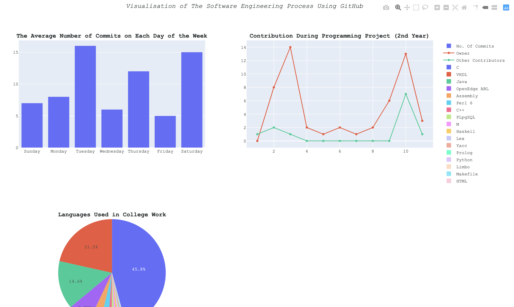

# Visualisation Of The Software Engineering Process

## Pre-requisites
+   [Python 3.7+](https://www.python.org/downloads/)

## Instructions to Build and Run Locally
+   Clone or download the repo: `git clone https://github.com/Lydtk/github-social-graph`
+   Navigate to the repo
+   Install Dependancies: `pip install -r requirements.txt`
+   Make sure you are in  `social-graph`
+   Run `python multiDisp.py`

